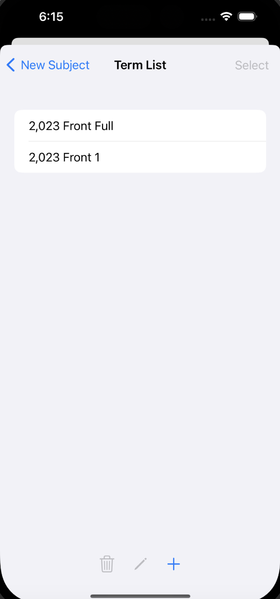

# SchoolSchedules
大学の講義の時間割用のアプリケーション．

## 基本機能
* 時間割の表示

* 講義情報の追加

* 講義の開設学期(Term)の追加

## 現在の問題
* 学期(Term)の削除が反映されない
* 学期(Term)の削除の確認ダイアログの表示二度目でクラッシュする

## 今後実装予定の機能
* 講義科目の詳細表示
* 学期ごとの受講科目の一覧表示
* ウィジェットの実装
* 講義のスケジュールの手動での移動，変更
* 大学メールアドレスの受信を監視するAPIと連携した自動的なスケジュール変更や講義情報変更．
